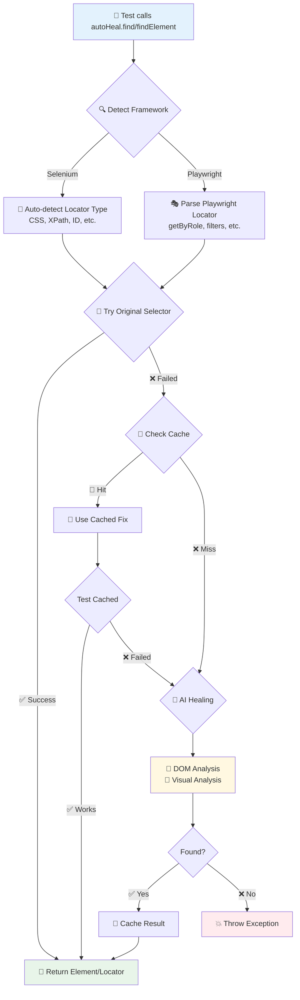

# 🤖 AutoHeal Locator - JavaScript/TypeScript

[](https://www.npmjs.com/package/@sdetsanjay/autoheal-locator)
[](https://opensource.org/licenses/MIT)
[](https://www.typescriptlang.org/)
[](https://playwright.dev/)
[](https://www.selenium.dev/)
[](https://nodejs.org/)
[](https://github.com/SanjayPG/autoheal-locator-js)

> **AI-powered test automation framework that automatically heals broken locators for both Selenium and Playwright in TypeScript/JavaScript.**

When your element locators break due to UI changes, AutoHeal intelligently finds the elements using DOM analysis, visual recognition, and smart fallback strategies.

---

## 🎯 Choose Your Framework

<table>
<tr>
<td width="50%" valign="top">

### 🟢 Selenium
Traditional WebDriver-based automation
- ✅ All locator types (CSS, XPath, ID, etc.)
- ✅ TypeScript/JavaScript API
- ✅ Mature ecosystem
- ✅ Wide browser support

**[📖 Selenium Demo - START_HERE.md](https://github.com/SanjayPG/autoheal-selenium-demo-ts/blob/main/START_HERE.md)**

**[📖 Selenium Demo - README.md](https://github.com/SanjayPG/autoheal-selenium-demo-ts)**

</td>
<td width="50%" valign="top">

### 🔵 Playwright
Modern automation framework
- ✅ Built-in auto-waiting
- ✅ Native network interception
- ✅ Multi-browser contexts
- ✅ Powerful selectors with filters

**[📖 Playwright Demo - START_HERE.md](https://github.com/SanjayPG/autoheal-playwright-demo-ts/blob/main/START_HERE.md)**

**[📖 Playwright Demo - README.md](https://github.com/SanjayPG/autoheal-playwright-demo-ts)**

</td>
</tr>
</table>

---

## 📖 Table of Contents

- [What is AutoHeal Locator?](#-what-is-autoheal-locator)
- [Why Use AutoHeal?](#-why-use-autoheal)
- [Key Features](#-key-features)
- [Architecture](#-architecture)
- [Installation](#-installation)
- [Quick Start](#-quick-start)
- [Configuration](#️-configuration)
- [Usage Examples](#-usage-examples)
- [Execution Strategies](#-execution-strategies)
- [AI Providers](#-ai-providers)
- [Caching](#-caching)
- [Reporting](#-reporting)
- [API Reference](#-api-reference)
- [Migration Guide](#-migration-guide)
- [Performance & Cost](#-performance--cost)
- [Comparison: Java vs JavaScript](#-comparison-java-vs-javascript)
- [Contributing](#-contributing)
- [Support](#-support)
- [License](#-license)

---

## 🎯 What is AutoHeal Locator?

**AutoHeal Locator** is an intelligent test automation framework that **automatically heals broken element locators** when your application's UI changes. Instead of manually updating hundreds of locators in your test suite, AutoHeal uses AI to find elements based on their semantic meaning and visual appearance.

### The Problem It Solves

Test automation often breaks due to:
- UI changes (redesigns, refactoring)
- Dynamic IDs and classes
- Framework upgrades
- A/B testing variations
- Internationalization changes

**Playwright - Traditional Approach:**
```typescript
// ❌ Test fails when button name changes from 'Submit' to 'Submit Form'
await page.getByRole('button', { name: 'Submit' }).click();
// Result: Test fails, manual fix required
```

**Playwright - AutoHeal Approach:**
```typescript
// ✅ Test continues working even when button name changes
const button = await autoHeal.find(
  page,
  page.getByRole('button', { name: 'Submit' }),  // Native Playwright locator
  'Submit button'  // Description for AI healing
);
await button.click();
// Result: AutoHeal finds the button using AI, test passes
```

**Selenium - Traditional Approach:**
```typescript
// ❌ Test fails when button ID changes from 'submit-btn' to 'submit-button'
const button = await driver.findElement(By.id('submit-btn'));
await button.click();
// Result: Test fails, manual fix required
```

**Selenium - AutoHeal Approach:**
```typescript
// ✅ Test continues working even when button ID changes
const button = await autoHeal.findElement(
  driver,
  'submit-btn',  // ID, CSS, or XPath - auto-detected
  'Submit button'  // Description for AI healing
);
await button.click();
// Result: AutoHeal finds the button using AI, test passes
```

---

## 💡 Why Use AutoHeal?

### Benefits

✅ **Reduced Maintenance**: Cut test maintenance time by 60-80%
✅ **Self-Healing Tests**: Tests automatically adapt to UI changes
✅ **Zero Code Changes**: Minimal modifications to existing tests
✅ **Multi-Framework**: Works with both Playwright and Selenium
✅ **Smart Caching**: Remembers fixes to avoid repeated AI calls
✅ **Cost-Effective**: Intelligent caching minimizes AI API costs
✅ **Comprehensive Reports**: HTML/JSON reports with healing analytics

### When to Use AutoHeal

- Large test suites with frequent UI changes
- Dynamic web applications
- Tests breaking due to locator changes
- Teams spending significant time on test maintenance
- CI/CD pipelines with flaky tests

---

## 🚀 Key Features

### Framework Support
- **Playwright** - Full support for all Playwright locators (getByRole, getByTestId, getByText, filters, etc.)
- **Selenium WebDriver** - Auto-detection of locator types (CSS, XPath, ID, Name, Class, etc.)

### AI Integration
Multiple AI provider support:
- 🔷 **Google Gemini** (Recommended - Fast & Cost-effective)
- 🟢 **OpenAI** (GPT-4, GPT-3.5)
- 🟣 **Anthropic Claude** (Claude 3)
- 🔵 **DeepSeek**
- 🔶 **Grok**
- 🟠 **Groq**

### Healing Strategies
- **DOM Analysis** - Fast, cheap, analyzes HTML structure
- **Visual Analysis** - Accurate, uses screenshots for complex scenarios
- **Hybrid Approach** - Combines DOM + Visual for best results
- **Smart Sequential** - Tries DOM first, falls back to Visual (Recommended)

### Performance Features
- **Persistent Caching** - File-based cache survives restarts
- **Memory Caching** - LRU cache for fast in-memory lookups
- **Success Rate Tracking** - Monitors cache effectiveness
- **Configurable Expiry** - Control cache lifetime

### Reporting
- **HTML Reports** - Beautiful, filterable reports with metrics
- **JSON Reports** - Machine-readable data for CI/CD integration
- **Token Usage Tracking** - Monitor AI API costs
- **Healing Analytics** - See what got healed and why

---

## 🏗️ Architecture

### High-Level Overview

```
┌─────────────────────────────────────────────────────────────┐
│                     Test Code                                │
│  (Playwright/Selenium tests with AutoHeal wrapper)          │
└────────────────────┬────────────────────────────────────────┘
                     │
                     ▼
┌─────────────────────────────────────────────────────────────┐
│                 AutoHealLocator (Facade)                     │
│  • Orchestrates healing workflow                            │
│  • Manages cache and AI providers                           │
└────────────────────┬────────────────────────────────────────┘
                     │
        ┌────────────┼────────────┐
        │            │            │
        ▼            ▼            ▼
┌─────────────┐ ┌─────────────┐ ┌─────────────┐
│   Adapter   │ │    Cache    │ │  AI Service │
│  (PW/Sel)   │ │ (File/Mem)  │ │  (Gemini)   │
└─────────────┘ └─────────────┘ └─────────────┘
```

### Healing Workflow

The following diagram illustrates the intelligent detection and healing process:



### Component Architecture

```
autoheal-locator/
├── core/                      # Core interfaces and orchestration
│   ├── AutoHealLocator.ts    # Main facade (entry point)
│   ├── ElementLocator.ts     # Element finding logic
│   ├── AIService.ts          # AI provider interface
│   ├── SelectorCache.ts      # Caching interface
│   └── WebAutomationAdapter.ts # Framework adapter interface
│
├── adapters/                  # Framework-specific implementations
│   ├── PlaywrightAdapter.ts  # Playwright integration
│   └── SeleniumAdapter.ts    # Selenium integration
│
├── ai/                        # AI provider implementations
│   ├── GeminiAIService.ts    # Google Gemini
│   ├── OpenAIService.ts      # OpenAI GPT
│   ├── AnthropicService.ts   # Anthropic Claude
│   ├── DeepSeekService.ts    # DeepSeek
│   ├── GrokService.ts        # Grok
│   └── GroqAIService.ts      # Groq
│
├── cache/                     # Caching implementations
│   ├── MemoryCache.ts        # In-memory LRU cache
│   └── FileCache.ts          # Persistent file cache
│
├── models/                    # Data models and types
│   ├── LocatorRequest.ts     # Healing request data
│   ├── LocatorResult.ts      # Healing result data
│   ├── CachedSelector.ts     # Cache entry structure
│   ├── ElementFingerprint.ts # Element identification
│   └── ...
│
├── config/                    # Configuration management
│   └── AutoHealConfiguration.ts # Settings and defaults
│
└── reporting/                 # Report generation
    └── AutoHealReporter.ts   # HTML/JSON report generation
```

### Healing Workflow

```
┌─────────────────────────────────────────┐
│  1. Try Original Selector                │
│     ✅ Found? → Return Element           │
│     ❌ Not Found? → Continue             │
└─────────────────────────────────────────┘
                 ↓
┌─────────────────────────────────────────┐
│  2. Check Cache                          │
│     ✅ Hit (>70% success)? → Try It      │
│     ❌ Miss? → Continue                  │
└─────────────────────────────────────────┘
                 ↓
┌─────────────────────────────────────────┐
│  3. AI Healing (Strategy-based)          │
│                                          │
│  DOM-ONLY:                               │
│    → DOM Analysis                        │
│                                          │
│  SMART_SEQUENTIAL (Recommended):         │
│    → DOM Analysis first                  │
│    → Visual Analysis if DOM fails        │
│                                          │
│  VISUAL_FIRST:                           │
│    → Visual Analysis first               │
│    → DOM Analysis if Visual fails        │
│                                          │
│  PARALLEL:                               │
│    → DOM + Visual simultaneously         │
│                                          │
└─────────────────────────────────────────┘
                 ↓
┌─────────────────────────────────────────┐
│  4. Cache Successful Result              │
│     → Store selector with metadata       │
│     → Track success rate                 │
│     → Set expiry (default: 24h)          │
└─────────────────────────────────────────┘
                 ↓
┌─────────────────────────────────────────┐
│  5. Return Element                       │
│     → Playwright: Locator object         │
│     → Selenium: WebElement object        │
└─────────────────────────────────────────┘
```

### Framework Adapters

**PlaywrightAdapter**:
- Converts Playwright `Locator` to internal format
- Supports all Playwright selector engines (text=, role=, data-testid=)
- Handles JavaScript API format (getByRole, getByTestId)
- Extracts element context for healing

**SeleniumAdapter**:
- Auto-detects locator types (CSS, XPath, ID, etc.)
- Converts Selenium `By` locators to internal format
- Extracts element properties (tag, attributes, text)
- Supports all Selenium locator strategies

### AI Service Layer

All AI providers implement a common interface:
```typescript
interface AIService {
  analyzeDOM(html, description, selector, framework): Promise<AIResult>
  analyzeVisual(screenshot, description): Promise<AIResult>
  selectBestMatchingElement(elements, description): Promise<Element>
}
```

**Prompts are framework-aware**:
- Playwright prompts return Playwright selector engine format (data-testid=, role=, text=)
- Selenium prompts return CSS/XPath selectors
- Context includes original selector, element description, and page HTML

---

## 📦 Installation

```bash
npm install @sdetsanjay/autoheal-locator

# or with yarn
yarn add @sdetsanjay/autoheal-locator

# or with pnpm
pnpm add @sdetsanjay/autoheal-locator
```

### Prerequisites

```bash
# For Playwright
npm install playwright

# For Selenium WebDriver
npm install selenium-webdriver
```

### Requirements

- **Node.js**: 16.0.0 or higher
- **TypeScript**: 5.2+ (for TypeScript projects)
- **Playwright**: 1.40+ (optional, for Playwright tests)
- **Selenium**: 4.15+ (optional, for Selenium tests)

---

## 🔑 Quick Start

### Step 1: Get an AI API Key

Choose an AI provider and get an API key:

- **Google Gemini** (Recommended): https://makersuite.google.com/app/apikey
- **OpenAI**: https://platform.openai.com/api-keys
- **Anthropic Claude**: https://console.anthropic.com/
- **DeepSeek**: https://platform.deepseek.com/
- **Grok**: https://console.x.ai/

### Step 2: Configure Environment

Create a `.env` file in your project root:

```bash
# AI Provider Configuration
GEMINI_API_KEY=your_api_key_here

# Optional: Other providers
# OPENAI_API_KEY=your_openai_key
# CLAUDE_API_KEY=your_claude_key
```

### Step 3: Basic Usage

#### Playwright Example

```typescript
import { chromium } from 'playwright';
import { AutoHealLocator } from '@sdetsanjay/autoheal-locator';

const browser = await chromium.launch();
const page = await browser.newPage();

// Create AutoHeal instance
const autoHeal = AutoHealLocator.builder()
  .withPlaywrightPage(page)
  .withAIProvider('gemini')
  .build();

await page.goto('https://example.com');

// Find element with self-healing
const button = await autoHeal.find(
  page,
  page.getByTestId('submit-btn'),
  'Submit button'
);
await button.click();

// Display metrics
const metrics = autoHeal.getCacheMetrics();
console.log(`Cache Hit Rate: ${(metrics.hitRate * 100).toFixed(2)}%`);

await browser.close();
autoHeal.shutdown();
```

#### Selenium Example

```typescript
import { Builder } from 'selenium-webdriver';
import { AutoHealLocator } from '@sdetsanjay/autoheal-locator';

const driver = await new Builder().forBrowser('chrome').build();

// Create AutoHeal instance
const autoHeal = AutoHealLocator.builder()
  .withSeleniumDriver(driver)
  .withAIProvider('gemini')
  .build();

await driver.get('https://example.com');

// Find element with self-healing
const button = await autoHeal.findElement('submit-btn', 'Submit button');
await button.click();

// Display metrics
const metrics = autoHeal.getCacheMetrics();
console.log(`Cache Hit Rate: ${(metrics.hitRate * 100).toFixed(2)}%`);

await driver.quit();
autoHeal.shutdown();
```

---

## 🛠️ Configuration

### Environment Variables

Create a `.env` file in your project root:

```bash
# ============================================
# AI Provider Configuration
# ============================================
AUTOHEAL_AI_PROVIDER=GOOGLE_GEMINI
GEMINI_API_KEY=your_gemini_api_key_here

# Optional: Other AI Providers
# OPENAI_API_KEY=your_openai_key
# CLAUDE_API_KEY=your_claude_key
# DEEPSEEK_API_KEY=your_deepseek_key
# GROK_API_KEY=your_grok_key
# GROQ_API_KEY=your_groq_key

# ============================================
# AI Model Configuration
# ============================================
AUTOHEAL_AI_MODEL=gemini-2.0-flash-exp
AUTOHEAL_AI_TIMEOUT=30000
AUTOHEAL_AI_MAX_RETRIES=3

# ============================================
# Cache Configuration
# ============================================
AUTOHEAL_CACHE_TYPE=PERSISTENT_FILE
AUTOHEAL_CACHE_MAX_SIZE=10000
AUTOHEAL_CACHE_DIRECTORY=./autoheal-cache
AUTOHEAL_CACHE_EXPIRE_AFTER_WRITE=86400000  # 24 hours in ms

# ============================================
# Performance Configuration
# ============================================
AUTOHEAL_EXECUTION_STRATEGY=SMART_SEQUENTIAL
AUTOHEAL_ELEMENT_TIMEOUT_MS=30000
AUTOHEAL_MAX_PARALLEL_EXECUTIONS=3

# ============================================
# Reporting Configuration
# ============================================
AUTOHEAL_REPORTING_ENABLED=true
AUTOHEAL_REPORTING_OUTPUT_DIR=./autoheal-reports
AUTOHEAL_REPORTING_GENERATE_HTML=true
AUTOHEAL_REPORTING_GENERATE_JSON=true

# ============================================
# Logging Configuration
# ============================================
AUTOHEAL_ENABLE_DEBUG_LOGS=false
```

### Programmatic Configuration

```typescript
import { AutoHealLocator, AIProvider, CacheType, ExecutionStrategy } from '@sdetsanjay/autoheal-locator';

const autoHeal = AutoHealLocator.builder()
  .withPlaywrightPage(page)
  .withConfiguration({
    ai: {
      provider: AIProvider.GOOGLE_GEMINI,
      apiKey: process.env.GEMINI_API_KEY!,
      model: 'gemini-2.0-flash-exp',
      timeout: 30000,
      maxRetries: 3,
      visualAnalysisEnabled: true,
    },
    cache: {
      type: CacheType.PERSISTENT_FILE,
      cacheDirectory: './autoheal-cache',
      maxSize: 10000,
      expireAfterWriteMs: 24 * 60 * 60 * 1000, // 24 hours
    },
    performance: {
      executionStrategy: ExecutionStrategy.SMART_SEQUENTIAL,
      elementTimeoutMs: 30000,
      maxParallelExecutions: 3,
    },
    reporting: {
      enabled: true,
      outputDirectory: './autoheal-reports',
      generateHtml: true,
      generateJson: true,
      generateText: false,
    },
    logging: {
      enableDebugLogs: false,
    },
  })
  .build();
```

---

## 📘 Usage Examples

### Page Object Model Pattern (Recommended)

#### Playwright + Page Object

**Step 1: Create AutoHeal Helper**

```typescript
// helpers/AutoHealHelper.ts
import { Page } from 'playwright';
import { AutoHealLocator, ExecutionStrategy } from '@sdetsanjay/autoheal-locator';

export class AutoHealHelper {
  private static instance: AutoHealLocator | null = null;

  static getAutoHeal(page: Page): AutoHealLocator {
    if (!this.instance) {
      this.instance = AutoHealLocator.builder()
        .withPlaywrightPage(page)
        .withAIProvider('gemini')
        .withStrategy(ExecutionStrategy.SMART_SEQUENTIAL)
        .build();
      console.log('✅ AutoHeal initialized');
    }
    return this.instance;
  }

  static reset(): void {
    if (this.instance) {
      this.instance.shutdown();
      this.instance = null;
    }
  }
}
```

**Step 2: Create Page Object**

```typescript
// pages/LoginPage.ts
import { Page, Locator } from 'playwright';
import { AutoHealHelper } from '../helpers/AutoHealHelper';

export class LoginPage {
  private autoHeal = AutoHealHelper.getAutoHeal(this.page);

  constructor(private page: Page) {}

  async getUsernameInput(): Promise<Locator> {
    return await this.autoHeal.find(
      this.page,
      this.page.getByTestId('username'),
      'Username input field'
    );
  }

  async getPasswordInput(): Promise<Locator> {
    return await this.autoHeal.find(
      this.page,
      this.page.getByTestId('password'),
      'Password input field'
    );
  }

  async getLoginButton(): Promise<Locator> {
    return await this.autoHeal.find(
      this.page,
      this.page.getByRole('button', { name: 'Login' }),
      'Login submit button'
    );
  }

  async login(username: string, password: string): Promise<void> {
    const usernameInput = await this.getUsernameInput();
    const passwordInput = await this.getPasswordInput();
    const loginButton = await this.getLoginButton();

    await usernameInput.fill(username);
    await passwordInput.fill(password);
    await loginButton.click();
  }
}
```

**Step 3: Use in Tests (Playwright Test)**

```typescript
// tests/login.spec.ts
import { test, expect } from '@playwright/test';
import { LoginPage } from '../pages/LoginPage';
import { AutoHealHelper } from '../helpers/AutoHealHelper';

test.describe('Login Tests', () => {
  let loginPage: LoginPage;

  test.beforeEach(async ({ page }) => {
    await page.goto('https://www.saucedemo.com/');
    loginPage = new LoginPage(page);
  });

  test.afterEach(async () => {
    AutoHealHelper.reset();
  });

  test('should login successfully with valid credentials', async ({ page }) => {
    await loginPage.login('standard_user', 'secret_sauce');
    await expect(page).toHaveURL(/.*inventory.html/);
  });

  test('should show error with invalid credentials', async ({ page }) => {
    await loginPage.login('invalid_user', 'wrong_password');
    const errorMessage = await page.locator('[data-test="error"]');
    await expect(errorMessage).toBeVisible();
  });
});
```

For more examples and complete documentation, visit:
- **Playwright Demo**: [START_HERE.md](https://github.com/SanjayPG/autoheal-playwright-demo-ts/blob/main/START_HERE.md) | [README.md](https://github.com/SanjayPG/autoheal-playwright-demo-ts)
- **Selenium Demo**: [START_HERE.md](https://github.com/SanjayPG/autoheal-selenium-demo-ts/blob/main/START_HERE.md) | [README.md](https://github.com/SanjayPG/autoheal-selenium-demo-ts)

---

## ⚡ Execution Strategies

AutoHeal supports multiple strategies for element healing:

| Strategy | Description | When to Use | AI Calls | Cost | Speed |
|----------|-------------|-------------|----------|------|-------|
| `DOM_ONLY` | Only DOM analysis | Stable UIs, cost-sensitive | 1 | 💰 Low | ⚡⚡⚡ Fast |
| `SMART_SEQUENTIAL` | DOM first, Visual if needed | **Recommended for most cases** | 1-2 | 💰💰 Medium | ⚡⚡ Medium |
| `SEQUENTIAL` | Always DOM then Visual | Comprehensive healing | 2 | 💰💰 Medium | ⚡ Slow |
| `VISUAL_FIRST` | Visual first, DOM fallback | Complex UIs, visual elements | 1-2 | 💰💰 High | ⚡ Slow |
| `PARALLEL` | DOM + Visual simultaneously | Speed critical, cost-tolerant | 2 | 💰💰💰 High | ⚡⚡⚡ Fast |

### Setting Strategy

```typescript
import { ExecutionStrategy } from '@sdetsanjay/autoheal-locator';

// Option 1: Builder pattern
const autoHeal = AutoHealLocator.builder()
  .withPlaywrightPage(page)
  .withStrategy(ExecutionStrategy.SMART_SEQUENTIAL)
  .build();

// Option 2: Environment variable
// .env file
AUTOHEAL_EXECUTION_STRATEGY=SMART_SEQUENTIAL
```

---

## 🤖 AI Providers

### Supported Providers

| Provider | Model Options | Speed | Cost | Best For |
|----------|--------------|-------|------|----------|
| **Google Gemini** | gemini-2.0-flash-exp | ⚡⚡⚡ | 💰 | **Recommended** |
| **OpenAI** | gpt-4o, gpt-3.5-turbo | ⚡⚡ | 💰💰💰 | High accuracy |
| **Anthropic Claude** | claude-3-sonnet | ⚡⚡ | 💰💰 | Complex reasoning |
| **DeepSeek** | deepseek-chat | ⚡⚡ | 💰 | Cost-effective |
| **Grok** | grok-beta | ⚡⚡ | 💰💰 | Real-time data |
| **Groq** | llama-70b-8192 | ⚡⚡⚡ | 💰 | Ultra-fast |

### Quick Setup

```typescript
// Simplest way - just pass the provider name
const autoHeal = AutoHealLocator.builder()
  .withPlaywrightPage(page)
  .withAIProvider('gemini') // Reads GEMINI_API_KEY from env
  .build();
```

Get API Keys:
- **Google Gemini**: https://makersuite.google.com/app/apikey
- **OpenAI**: https://platform.openai.com/api-keys
- **Anthropic**: https://console.anthropic.com/
- **DeepSeek**: https://platform.deepseek.com/

---

## 💾 Caching

AutoHeal supports two cache types:

| Type | Persistence | Speed | Best For |
|------|------------|-------|----------|
| `PERSISTENT_FILE` | ✅ Survives restarts | ⚡⚡ Medium | CI/CD, Long-running tests |
| `MEMORY` | ❌ In-memory only | ⚡⚡⚡ Fast | Local development |

```typescript
import { CacheType } from '@sdetsanjay/autoheal-locator';

const autoHeal = AutoHealLocator.builder()
  .withPlaywrightPage(page)
  .withConfiguration({
    cache: {
      type: CacheType.PERSISTENT_FILE,
      cacheDirectory: './autoheal-cache',
      maxSize: 10000,
      expireAfterWriteMs: 7 * 24 * 60 * 60 * 1000, // 7 days
    },
  })
  .build();

// Get cache metrics
const metrics = autoHeal.getCacheMetrics();
console.log(`Hit Rate: ${(metrics.hitRate * 100).toFixed(2)}%`);
```

---

## 📊 Reporting

AutoHeal generates comprehensive HTML and JSON reports after each test run.

```typescript
const autoHeal = AutoHealLocator.builder()
  .withPlaywrightPage(page)
  .withConfiguration({
    reporting: {
      enabled: true,
      outputDirectory: './autoheal-reports',
      generateHtml: true,  // Interactive HTML report
      generateJson: true,  // Machine-readable JSON
    },
  })
  .build();
```

**Reports include:**
- Summary statistics (success rate, healing count)
- Filterable table of all selector healing attempts
- Strategy breakdown (DOM vs Visual)
- Token usage and cost estimation
- Color-coded status indicators

---

## 📚 API Reference

### AutoHealLocator

#### Builder Pattern

```typescript
const autoHeal = AutoHealLocator.builder()
  .withPlaywrightPage(page)           // For Playwright
  .withSeleniumDriver(driver)         // For Selenium
  .withAIProvider('gemini')           // Quick AI setup
  .withStrategy(ExecutionStrategy.SMART_SEQUENTIAL)
  .withConfiguration({ ... })         // Full config
  .build();
```

#### Playwright API

```typescript
// Find element with self-healing
async find(
  page: Page,
  locatorOrSelector: Locator | string,
  description: string
): Promise<Locator>
```

#### Selenium API

```typescript
// Find single element
async findElement(selector: string, description: string): Promise<WebElement>

// Find multiple elements
async findElements(selector: string, description: string): Promise<WebElement[]>
```

#### Utility Methods

```typescript
getCacheMetrics(): CacheMetrics  // Get cache performance
clearCache(): void               // Clear all cached selectors
getReporter(): AutoHealReporter  // Get reporter instance
shutdown(): void                 // Shutdown and persist cache
```

---

## 🔄 Migration Guide

### Migrating from Pure Playwright

**Before:**
```typescript
await page.getByRole('textbox', { name: 'Username' }).fill('user');
await page.getByRole('textbox', { name: 'Password' }).fill('pass');
await page.getByRole('button', { name: 'Login' }).click();
```

**After:**
```typescript
const autoHeal = AutoHealLocator.builder()
  .withPlaywrightPage(page)
  .withAIProvider('gemini')
  .build();

const username = await autoHeal.find(
  page,
  page.getByRole('textbox', { name: 'Username' }),  // Native Playwright locator
  'Username field'  // Description for AI healing
);
const password = await autoHeal.find(
  page,
  page.getByRole('textbox', { name: 'Password' }),  // Native Playwright locator
  'Password field'  // Description for AI healing
);
const loginBtn = await autoHeal.find(
  page,
  page.getByRole('button', { name: 'Login' }),  // Native Playwright locator
  'Login button'  // Description for AI healing
);

await username.fill('user');
await password.fill('pass');
await loginBtn.click();

autoHeal.shutdown();
```

---

## 💰 Performance & Cost

### Token Usage

| Operation | Typical Tokens | Cost (Gemini) | Cost (GPT-4) |
|-----------|---------------|---------------|--------------|
| DOM Analysis | 1,500-3,000 | $0.0001 | $0.015 |
| Visual Analysis | 3,000-5,000 | $0.0002 | $0.030 |
| Cache Hit | 0 | $0 | $0 |

### Cost Optimization

1. **Use Caching**: Enable persistent file cache
2. **Choose Strategy**: Use `DOM_ONLY` or `SMART_SEQUENTIAL`
3. **Select Provider**: Gemini is 100x cheaper than GPT-4
4. **Monitor Usage**: Check reports for token consumption

---

## 🆚 Comparison: Java vs JavaScript

| Feature | Java Implementation | JavaScript/TypeScript |
|---------|-------------------|---------------------|
| **Repository** | [SanjayPG/autoheal-locator](https://github.com/SanjayPG/autoheal-locator) | [@sdetsanjay/autoheal-locator](https://github.com/SanjayPG/autoheal-locator-js) |
| **Package Manager** | Maven/Gradle | npm/yarn/pnpm |
| **Language** | Java 17+ | TypeScript/JavaScript |
| **Playwright** | ✅ Java API | ✅ Node.js API |
| **Selenium** | ✅ WebDriver 4.x | ✅ WebDriver 4.x |
| **AI Providers** | Gemini, OpenAI, Claude | Gemini, OpenAI, Claude, DeepSeek, Grok, Groq |
| **Caching** | Redis, File, Caffeine | File, Memory (LRU) |
| **Configuration** | application.properties | .env + JSON |
| **Type Safety** | ✅ Compile-time | ✅ TypeScript |

---

## 🤝 Contributing

Contributions are welcome! This is the JavaScript/TypeScript port of the [Java implementation](https://github.com/SanjayPG/autoheal-locator).

### Development Setup

```bash
# Clone the repository
git clone https://github.com/SanjayPG/autoheal-locator-js.git
cd autoheal-locator

# Install dependencies
npm install

# Build the project
npm run build

# Run examples
npx ts-node examples/playwright-example.ts
```

### Related Projects

- **Java Version**: [SanjayPG/autoheal-locator](https://github.com/SanjayPG/autoheal-locator)
- **Playwright Demo**: [SanjayPG/autoheal-playwright-demo-ts](https://github.com/SanjayPG/autoheal-playwright-demo-ts) - [START_HERE.md](https://github.com/SanjayPG/autoheal-playwright-demo-ts/blob/main/START_HERE.md)
- **Selenium Demo**: [SanjayPG/autoheal-selenium-demo-ts](https://github.com/SanjayPG/autoheal-selenium-demo-ts) - [START_HERE.md](https://github.com/SanjayPG/autoheal-selenium-demo-ts/blob/main/START_HERE.md)

---

## 🙋 Support

### Documentation
- **Main Docs**: This README
- **AI Provider Setup**: See [AI_PROVIDERS.md](./AI_PROVIDERS.md)
- **Java Version**: [Java AutoHeal Docs](https://github.com/SanjayPG/autoheal-locator)

### Get Help
- **Bug Reports**: [GitHub Issues](https://github.com/SanjayPG/autoheal-locator-js/issues)
- **Feature Requests**: [GitHub Issues](https://github.com/SanjayPG/autoheal-locator-js/issues)
- **Questions**: [GitHub Discussions](https://github.com/SanjayPG/autoheal-locator-js/discussions)

### Stay Updated
- **GitHub**: https://github.com/SanjayPG/autoheal-locator-js
- **NPM Package**: https://www.npmjs.com/package/@sdetsanjay/autoheal-locator

---

## ☕ Support the Project

If AutoHeal Locator is saving your team time and reducing test maintenance, consider supporting the project:

- ☕ [Buy Me a Coffee](https://buymeacoffee.com/sdetsanjay)
- ⭐ [Star the Repository](https://github.com/SanjayPG/autoheal-locator-js)
- 📢 Share with your team and community

Your support helps maintain and improve AutoHeal Locator!

---

## 📄 License

MIT License

Copyright (c) 2024 Sanjay Gorai

Permission is hereby granted, free of charge, to any person obtaining a copy
of this software and associated documentation files (the "Software"), to deal
in the Software without restriction, including without limitation the rights
to use, copy, modify, merge, publish, distribute, sublicense, and/or sell
copies of the Software, and to permit persons to whom the Software is
furnished to do so, subject to the following conditions:

The above copyright notice and this permission notice shall be included in all
copies or substantial portions of the Software.

THE SOFTWARE IS PROVIDED "AS IS", WITHOUT WARRANTY OF ANY KIND, EXPRESS OR
IMPLIED, INCLUDING BUT NOT LIMITED TO THE WARRANTIES OF MERCHANTABILITY,
FITNESS FOR A PARTICULAR PURPOSE AND NONINFRINGEMENT. IN NO EVENT SHALL THE
AUTHORS OR COPYRIGHT HOLDERS BE LIABLE FOR ANY CLAIM, DAMAGES OR OTHER
LIABILITY, WHETHER IN AN ACTION OF CONTRACT, TORT OR OTHERWISE, ARISING FROM,
OUT OF OR IN CONNECTION WITH THE SOFTWARE OR THE USE OR OTHER DEALINGS IN THE
SOFTWARE.

---

<div align="center">

### 🎭 AutoHeal Locator

**Made with ❤️ for the Test Automation Community**

**Self-Healing Tests • AI-Powered • Playwright & Selenium**

[](https://github.com/SanjayPG/autoheal-locator-js)
[](https://www.npmjs.com/package/@sdetsanjay/autoheal-locator)

[⭐ Star on GitHub](https://github.com/SanjayPG/autoheal-locator-js) • [📦 View on NPM](https://www.npmjs.com/package/@sdetsanjay/autoheal-locator) • [📖 Java Version](https://github.com/SanjayPG/autoheal-locator)

</div>
